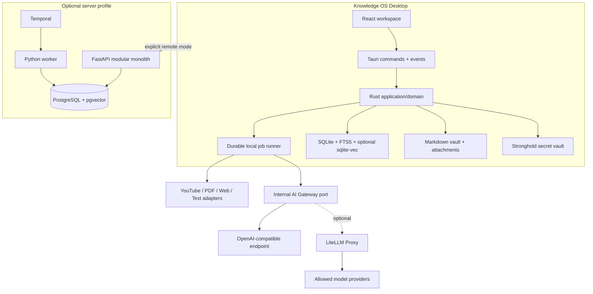

# Knowledge OS MVP Design

**Spec:** `.specs/features/knowledge-os-mvp/spec.md`

**Context:** `.specs/features/knowledge-os-mvp/context.md`

**Status:** Approved by owner direction to proceed on 2026-07-24

## Architecture Choice

Three viable approaches were evaluated against the same product scope.

| Approach | Strengths | Costs / risks | Verdict |
| --- | --- | --- | --- |
| Native local core: Tauri/React + Rust domain, optional Python API/worker | Strongest offline behavior, small native distribution, secrets/filesystem remain outside renderer, no bundled Python | More cross-language contracts and Rust work | **Chosen** |
| Tauri UI + bundled Python sidecar for all domain work | Fast Python ecosystem for AI/parsers; one language shared with cloud | Heavy cross-platform packaging, process lifecycle/security complexity, weaker native/offline boundary | Rejected |
| Thin desktop over required cloud API | Simplest single backend and centralized operations | Violates local-first, adds latency/availability/cost to ordinary knowledge work | Rejected |

The chosen approach matches the source architecture and the real usage pattern: the application remains a useful knowledge system with every optional service stopped.

## Architecture Overview



### Hard Boundaries

1. React renders state and requests use cases; it never reads arbitrary filesystem paths, SQLite, provider secrets or cloud credentials.
2. Tauri IPC exposes narrow, schema-validated application commands. Progress is sent through typed events.
3. Rust owns local domain rules, vault writes, SQLite transactions, ingestion, retrieval and direct provider HTTP.
4. Python API/worker are optional deployment targets, not runtime dependencies of the desktop.
5. Canonical knowledge is Markdown plus provenance; database indexes are versioned and rebuildable.

Tauri 2 uses a Rust/webview boundary and capability files to constrain what each window may invoke, so every window receives only the minimum command/plugin permissions it needs ([Tauri architecture](https://v2.tauri.app/concept/architecture/), [capabilities](https://v2.tauri.app/security/capabilities/)).

## Repository Architecture

```text
knowledge-os/
├── apps/
│   ├── desktop/                 # React/Vite UI + Tauri host
│   ├── api/                     # optional FastAPI modular monolith
│   └── worker/                  # optional Python activities/workflows
├── crates/
│   ├── knowledge-domain/        # entities, invariants, ports
│   ├── knowledge-storage/       # SQLite, migrations, vault journal
│   ├── knowledge-ingestion/     # jobs, adapters, chunking, rendering
│   ├── knowledge-retrieval/     # FTS, vectors, fusion, context builder
│   ├── knowledge-graph/         # resolution, edges, traversal
│   └── knowledge-ai/            # AI port, policy, HTTP adapter, cache
├── packages/
│   ├── ui/                      # reusable React primitives/tokens
│   ├── contracts/               # JSON Schema + generated TS bindings
│   └── test-fixtures/           # deterministic source/provider fixtures
├── infra/
│   ├── docker/                  # api, worker, LiteLLM
│   ├── terraform/               # modules + staging/production examples
│   ├── kubernetes/
│   └── helm/
├── ops/                              # OTel, Prometheus, Grafana, Loki
├── docs/                             # ADRs, architecture, product, runbooks
├── tests/                            # cross-process integration/e2e/perf
├── scripts/
├── Cargo.toml                        # Rust workspace
├── pnpm-workspace.yaml               # TypeScript workspace
├── pyproject.toml                    # uv Python workspace
├── Makefile                          # stable human/CI entry points
└── docker-compose.yml                # optional profiles
```

pnpm, Cargo and uv each own one ecosystem and lockfile; Make targets compose them without hiding native commands. uv workspaces provide one lockfile across related Python packages ([uv workspaces](https://docs.astral.sh/uv/concepts/projects/workspaces/)); pnpm provides native workspace support ([pnpm](https://pnpm.io/)). No generic task orchestrator is added until measurements justify one.

## Desktop Components

### Primary interaction model

```text
┌─ Ingest ──────────────────────────────────────────────────┐
│                                                                  │
│            Paste a link, text, or drop knowledge here            │
│            [ +  Add knowledge…                 ↑ ]            │
│            current processing progress / destination             │
│                                                                  │
└──────────────────────────────────────────────────────────────────┘

┌─ Retrieve ──────────────────────────────────────────────────┐
│ Explorer          │ Markdown / Graph / Source       │ Assistant        │
│ folders + files   │ tabbed knowledge canvas         │ grounded chat    │
│ projects/areas    │                                  │ model selector   │
│ concepts          │                                  │ composer         │
└──────────────────┴──────────────────────────────────┴─────────────────┘
```

The product opens onboarding first when required, then a compact top-level `Ingest`/`Retrieve` switch. `Ingest` avoids permanent navigation chrome so capture feels as immediate as a modern AI composer. `Retrieve` is the durable knowledge workstation. Pane layout is persistent, keyboard controlled and usable with either side pane collapsed.

The right assistant receives only the active retrieval scope, selected document/view context and explicitly retrieved evidence. In the MVP it exposes `ask`, `cancel`, citation navigation and allowed-model selection. File mutations, shell/research tools and autonomous plans are absent at both UI and IPC capability levels.

| Component | Location | Purpose and interface |
| --- | --- | --- |
| App shell | `apps/desktop/src/app/` | First-run gate, `Ingest`/`Retrieve` mode switch, status and routing |
| Onboarding | `apps/desktop/src/onboarding/` | Explicit accountless create/open local-vault flow, optional AI setup, protected provider setup, model policy and budgets |
| Ingest surface | `apps/desktop/src/ingest/` | Single URL/text/file composer with progress and destination result |
| Workspace | `apps/desktop/src/workspace/` | `openView`, `splitView`, `pinView`, `restoreLayout`; persists serializable layout |
| Editor | `apps/desktop/src/editor/` | CodeMirror-based Markdown editor with frontmatter/wiki-link awareness |
| Capture | `apps/desktop/src/sources/` | One quick-add surface; dispatches `capture_source` and observes job events |
| Library | `apps/desktop/src/library/` | Faceted browsing across projects, areas, types, concepts and review Inbox |
| Graph | `apps/desktop/src/graph/` | Sigma/Graphology local and global graph views; bounded expansion |
| Search | `apps/desktop/src/search/` | Exact/FTS/hybrid results with snippets, filters and retrieval explanation |
| Assistant | `apps/desktop/src/assistant/` | Read-only query, model selector, retrieval trace, answer and resolvable citations |
| Command palette | `apps/desktop/src/commands/` | Registry shared by keyboard shortcuts, menus and palette |
| Settings | `apps/desktop/src/settings/` | Accessible settings navigation; provider connections and masked secret lifecycle; model catalog/roles; budgets, usage and privacy |
| IPC client | `apps/desktop/src/lib/ipc/` | Generated typed wrappers; the only frontend entry to privileged operations |

UI server state uses TanStack Query; small ephemeral workspace state uses Zustand. Domain state is not duplicated into a permanent frontend store. Visual tokens live in `packages/ui`; no generic dashboard/card layout is introduced.

### Settings information architecture

```text
Settings
├── General
├── Vault
├── AI Providers
│   ├── OpenAI     connected / test / rotate / remove
│   ├── Anthropic  connected / test / rotate / remove
│   └── DeepSeek   connected / test / rotate / remove
├── Models & Routing
│   ├── Main (extraction, categorization and organization)
│   ├── Assistant default
│   ├── Embeddings
│   └── Explicit fallbacks
├── Costs & Usage
├── Privacy
└── Advanced
```

Provider rows reveal only provider identity, endpoint, masked credential state, last health check and enabled models. Secret creation/rotation uses a password input and a narrow secure command; stored values are never rendered again.

### Accountless local vault flow

`Continue without account` is the default local-first path. `Create local knowledge base` accepts a validated vault name and a parent directory chosen through the native dialog capability, resolves the exact target in Rust, rejects traversal/collisions and stages initialization before an atomic publish. The initialized vault contains ordinary user-visible folders/Markdown plus reconstructible `.knowledge-os/` local metadata and SQLite state. Failure removes only the staging directory created by that operation. `Open existing local vault` grants a separate explicitly selected root. Neither path performs a network request or creates an identity.

## Rust Core Components and Interfaces

### Application use cases

`knowledge-domain` defines entities, typed errors and ports. Use cases are explicit commands/queries:

```rust
trait CaptureSource { async fn capture(input: CaptureInput) -> Result<CaptureReceipt, AppError>; }
trait ManageWorkspace { async fn open(root: WorkspacePath) -> Result<Workspace, AppError>; }
trait OrganizeKnowledge { async fn organize(document_id: DocumentId) -> Result<OrganizationPlan, AppError>; }
trait SearchKnowledge { async fn search(query: SearchQuery) -> Result<SearchResponse, AppError>; }
trait AskKnowledge { async fn ask(query: AskQuery) -> Result<AnswerStream, AppError>; }
```

Concrete Tauri commands deserialize generated contracts, call one use case and map typed errors. They contain no SQL or provider logic.

### Storage and vault

`knowledge-storage` provides repositories, migrations, FTS5, vector metadata and a write journal:

```rust
trait UnitOfWork { async fn transaction<T>(&self, f: ...) -> Result<T, StorageError>; }
trait VaultStore { async fn stage(...); async fn publish(...); async fn recover(...); }
trait SearchIndex { async fn index(...); async fn lexical(...); async fn rebuild(...); }
trait VectorIndex { async fn upsert(...); async fn nearest(...); }
```

SQLite runs in WAL mode with foreign keys enabled, a bounded read pool and one serialized writer. FTS5 uses an external-content table maintained in the same transaction as chunks; an integrity/rebuild command detects drift. FTS5 provides BM25 ranking and snippets locally ([SQLite FTS5](https://www.sqlite.org/fts5.html)).

The optional vector adapter statically embeds `sqlite-vec` in the Rust binary, avoiding a separately installed extension; it is behind `VectorIndex` and can be disabled without affecting lexical search ([sqlite-vec Rust integration](https://alexgarcia.xyz/sqlite-vec/rust.html)).

Cross-resource Markdown writes use a recoverable journal:

1. Render into `.knowledge-os/staging/<operation-id>` and fsync.
2. Begin SQLite transaction; persist revision, index inputs and journal state `DB_COMMITTED`.
3. Commit database transaction.
4. Atomically rename the staged file inside the same filesystem and set journal `PUBLISHED`.
5. Startup recovery publishes committed staging files or removes pre-commit orphans; it never guesses from partial content.

### Local jobs and ingestion

`knowledge-ingestion` contains a SQLite-backed job queue and adapters:

```rust
trait SourceAdapter { fn supports(&self, input: &CaptureInput) -> bool; async fn extract(...) -> ExtractedSource; }
trait Chunker { fn chunk(&self, source: &ExtractedSource) -> Vec<ChunkDraft>; }
trait MarkdownRenderer { fn render(&self, extraction: &KnowledgeExtraction) -> String; }
trait JobRunner { async fn claim(...); async fn heartbeat(...); async fn complete(...); }
```

- Two jobs may run concurrently per workspace; steps for one source/version remain ordered.
- A lease/heartbeat lets crashed jobs be reclaimed safely.
- Unique key `(content_hash, operation, pipeline_version, prompt_version, model_version)` makes every expensive step idempotent.
- Adapters run deterministic extraction first: transcript, PDF text/OCR fallback, readability-cleaned web text, Markdown/text normalization.
- Chunking follows headings, sections, paragraph groups and transcript topic/timestamp boundaries. The target is 350–900 tokens; overlap is added only across a genuine semantic boundary.
- Standard mode makes one structured extraction call for a source that fits budget. Large sources filter sections locally and synthesize bounded selected material.

## Knowledge and Organization Model

### Core data model

| Model | Important fields / invariants |
| --- | --- |
| `Workspace` | id, root path, schema version, settings; path must be explicitly granted |
| `Source` | id, kind, original URI/path, current revision, status, timestamps, metadata |
| `SourceRevision` | source id, content hash, normalized hash, pipeline version; immutable and unique |
| `Document` | revision id, Markdown path, title, summary, language, prompt/model versions |
| `Chunk` | document id, position, heading, text, token count, source locator, content hash |
| `Concept` | name, normalized name, slug, description; normalized name unique within workspace |
| `ConceptAlias` | concept id, normalized alias, origin (`user`, `source`, `model`), pinned flag |
| `KnowledgeEdge` | source concept, target concept, allowed relation type; no self-edge; canonical tuple unique |
| `EdgeEvidence` | edge id, document/chunk locator, confidence; preserves multiple origins |
| `Facet` | kind (`project`, `area`, `tag`, `source_type`, custom), name, optional parent; extensible |
| `Membership` | item type/id, facet id, origin, confidence, pinned; supports many-to-many placement |
| `OrganizationDecision` | candidates, selected action, signals, thresholds, prior state, undo state, timestamp |
| `IngestionJob` | source revision, step, state, attempt, lease, typed error, progress |
| `AIInvocation` | operation, policy/model/provider, token/cost/latency/cache metadata; no raw secret |
| `AIArtifact` | cache key, schema/prompt/model versions, validated structured result |
| `EmbeddingRecord` | owner type/id, model/version, content hash, vector reference |
| `ProviderConnection` | provider kind, endpoint, Stronghold credential reference, masked state, health and timestamps; never contains plaintext in query results |
| `ModelProfile` | provider connection, remote model id, display name, capabilities, context limits, price metadata, enabled/health state |
| `TaskModelAssignment` | semantic role, primary model and explicit ordered fallbacks; exactly one eligible primary for `organization.main` |

### Adaptive organization algorithm

Organization is incremental and bounded:

1. Extract candidate concepts/facets once from the current source.
2. Generate local candidates from pinned user rules/corrections, exact normalized names, aliases, FTS similarity, graph neighbors and optional top-k vectors.
3. Score only that candidate set; never serialize the whole vault into a prompt.
4. Apply automatically when a pinned rule/exact canonical match exists, or combined confidence is `>= 0.90` with a margin `>= 0.08` over the next candidate.
5. Scores `0.65–0.899` become review suggestions. Lower scores leave the item in Inbox without blocking search/use.
6. Store signals, score, action and prior state in `OrganizationDecision`; undo restores prior memberships/edges transactionally.
7. User corrections create pinned aliases/rules that outrank inferred signals on later ingestion.

The system grows more useful through local aliases, graph connectivity, summaries, feedback and retrieval signals. It does not retrain a model or perform vault-wide reclassification implicitly.

## Retrieval and RAG

### Query planning

Routing is deterministic:

| Query signal | Plan |
| --- | --- |
| Quoted phrase | exact + FTS phrase |
| Exact concept/title/alias | concept lookup + FTS + one-hop graph |
| Natural-language question | FTS + optional vector + one-hop graph |
| “related to X” | concept lookup + typed graph traversal |

All plans accept project, area, source type, concept and time filters. No LLM call chooses a retrieval plan.

### Ranking and context

- FTS5 BM25, vector similarity and graph proximity are fused with deterministic reciprocal-rank fusion; exact/pinned matches receive explicit boosts.
- Results are deduplicated by chunk content hash and stable tie-breakers `(score, document_id, position)`.
- Graph expansion defaults to one hop and a fixed node/edge limit; deeper expansion is an explicit UI action.
- Search target KOS-024 is p95 `<= 200 ms` after warm-up for 100 representative lexical queries over 10,000 documents / up to 100,000 chunks on the documented Linux CI runner.
- Assistant context prefers stored summaries, then detail chunks; normally 3–8 chunks, maximum two chunks per source until diversity is satisfied, and a default 12k-input-token ceiling.
- If no candidate clears the evidence threshold, generation is skipped and the assistant reports that the vault lacks support.
- Otherwise exactly one answer call receives compact source locators and returns citation IDs that must resolve against the retained context before display.

## AI Gateway and Cost Policy

Product code depends on:

```rust
trait AiGateway {
  async fn structured<T>(&self, request: StructuredRequest<T>) -> Result<AIResult<T>, AIError>;
  async fn answer(&self, request: AnswerRequest) -> Result<AnswerResult, AIError>;
  async fn embed(&self, request: EmbeddingRequest) -> Result<EmbeddingResult, AIError>;
}
```

`ModelPolicy` maps semantic task classes (`organization.main`, `assistant.answer`, `embed`) to configured model assignments with capability requirements, explicit ordered fallbacks and maximum input/output price. The visible `Main` assignment is the stable primary for extraction, categorization and organization; policy does not silently replace it with the cheapest model. The assistant may select another configured, healthy, policy-allowed model per conversation. An unavailable primary uses a fallback only when the user configured one explicitly. Unknown price is ineligible unless the user opts in. The application preflights estimated tokens/cost, passes hard `max_tokens`, records actual usage and stops/fails closed at workspace daily/monthly limits.

LiteLLM Proxy is preferred because it exposes a provider-neutral OpenAI format, retry/fallback routing, cost tracking, budgets and rate limiting ([LiteLLM documentation](https://docs.litellm.ai/)). It is a transport gateway, not the product's semantic router: task classification, privacy rules, cache keys and budget decisions remain in Knowledge OS.

Alternatives remain possible behind the same port:

- Portkey offers open-source routing/fallback, but advanced budget enforcement can be plan-dependent ([Portkey gateway](https://portkey.ai/docs/product/open-source), [budget limits](https://portkey.ai/docs/product/ai-gateway/virtual-keys/budget-limits)).
- OpenRouter offers hosted multi-provider price/fallback routing, but adds an external aggregation/billing dependency ([OpenRouter provider routing](https://openrouter.ai/docs/guides/routing/provider-selection)).

The desktop supports direct OpenAI and DeepSeek transports through their OpenAI-compatible APIs, Anthropic through its native Messages API, and compatible LiteLLM/OpenRouter/local endpoints behind the same internal port. API secrets are independent per provider. A new or rotated key exists transiently in the renderer's password input and secure IPC payload, then Rust writes it to Stronghold. Stored secrets are never read back into the renderer: queries expose masked state only. Stronghold is the supported Tauri secret engine and requires explicit capability permissions ([Tauri Stronghold](https://v2.tauri.app/plugin/stronghold/)). Secret values and prompt/response bodies are excluded from logs by default.

## Optional Server Architecture

`apps/api` and `apps/worker` use Python/FastAPI with feature-first modules. API contracts are emitted as OpenAPI/JSON Schema and compatibility-tested against `packages/contracts`.

- API: identity boundary for remote mode, sources, documents, knowledge, graph, retrieval, assistant, sync boundary and audit.
- Worker: parsers, extractors, embeddings, indexing and Temporal activities/workflows.
- PostgreSQL/pgvector, Redis, MinIO, Temporal and LiteLLM run only in explicit Compose profiles.
- Server acceptance uses a transactional outbox; worker consumers deduplicate with the same operation/version key.
- Desktop local mode never waits for these services; remote mode is explicitly selected per workspace.

## IPC and Events

Commands are coarse use cases, not database primitives:

```text
workspace_open, workspace_get_state, workspace_update_layout
source_capture, source_retry, source_cancel, source_delete
document_open, document_save
library_list, organization_review, organization_undo
search_execute, graph_expand
assistant_ask, assistant_cancel
settings_get, settings_update, provider_test
```

Events carry `operation_id`, monotonic sequence and typed payload:

```text
job.progress, job.completed, job.failed
document.changed, index.updated
assistant.retrieval, assistant.delta, assistant.completed, assistant.failed
```

The frontend discards duplicate/older event sequences and refetches authoritative state after reconnect/restart.

## Error Handling Strategy

| Scenario | Handling | User impact |
| --- | --- | --- |
| Invalid/oversize/unsafe input | Reject before persistence with stable error code and field details | Capture form keeps input and explains correction |
| Duplicate content | Return existing source/revision receipt and cache metadata | No duplicate item or extra AI cost |
| Parser/fetch transient failure | Bounded retry with same key; persist typed failure and artifacts | Retry action resumes eligible step |
| Invalid AI schema/budget | Reject artifact before canonical mutation | Visible failure; existing knowledge unchanged |
| Provider offline/budget exhausted | Retrieval continues; generation fails closed | Results remain inspectable; no surprise spend |
| File/database interruption | Recover from staging journal on startup | No partial canonical Markdown |
| FTS/vector drift | Integrity diagnostic; rebuild derived index from canonical records | Search temporarily degraded, vault intact |
| Unknown citation | Reject generated answer as invalid | No fabricated/unresolvable citation shown |

## Security Design

- Default-deny Tauri capability files per window; no remote content can access IPC.
- Vault paths are canonicalized and checked against the granted workspace scope before every file operation.
- Only `http`/`https` URLs pass capture; redirects are revalidated and private/link-local destinations are blocked by default to reduce SSRF risk.
- HTML is converted through readability/sanitization and never executed; PDF/OCR/parsers run with input/time/resource limits.
- Provider credentials use Stronghold; `.env` is development-only and ignored.
- SQLite parameters are bound; Markdown rendering escapes executable HTML in preview.
- Logs, traces and metrics exclude raw source bodies, prompts, completions and keys unless an explicit short-lived diagnostic mode is enabled.
- Dependencies are pinned/locked and scanned in CI; backend containers are non-root.

## Observability

Every operation has `operation_id`, `workspace_id`, optional `source_id`, stage, duration and outcome. Local structured logs rotate within `.knowledge-os/logs`; OpenTelemetry export is opt-in. AI metrics include task class, policy/model/provider, estimated/actual tokens and cost, cache status, retry/fallback count and latency. Dashboards aggregate counts/costs but never source text.

## Code Reuse Analysis

There is no application code to reuse yet. The authoritative reusable inputs are:

| Artifact | How it constrains implementation |
| --- | --- |
| `knowledge-os-system-design.md` | Product architecture, milestones, entity fields, pipeline and operational requirements |
| `.specs/features/knowledge-os-mvp/spec.md` | 53 testable requirements and edge cases |
| `.specs/features/knowledge-os-mvp/context.md` | Real usage, non-rigid organization, RAG and cost-control decisions |
| `.specs/STATE.md` | Active cross-feature architecture/governance decisions |

Generated contracts, fixtures and UI primitives become the reuse base for later phases; duplication across Rust/TypeScript/Python is prohibited where generation is practical.

## Requirement-to-Component Mapping

| Requirements | Owning components |
| --- | --- |
| KOS-001…005 | desktop shell/workspace/editor, IPC, local store |
| KOS-006…013 | capture UI, ingestion adapters, local jobs, state machine |
| KOS-014…019 | domain models, storage/vault, renderer, graph/entity resolution |
| KOS-020…024 | FTS/vector/graph retrieval, search/graph UI, benchmarks |
| KOS-025…030 | AI port, structured schemas, cache, model/cost policy, metrics |
| KOS-031…035 | query planner, rank fusion, context builder, assistant UI |
| KOS-036…039 | optional API, worker, outbox and Temporal profile |
| KOS-040…047 | Make/Compose, CI/release, IaC, observability, backup/runbooks |
| KOS-048…053 | facets/memberships, organization policy/audit, scoped retrieval, model policy |
| KOS-054…058 | app shell/onboarding, Ingest composer, Retrieve workspace and read-only assistant |
| KOS-059…062 | AI settings, provider connections/Stronghold, model catalog/roles and assistant selection |
| KOS-063 | accountless native local-vault creation/opening and initialization |

All 63 requirements have an owning component; Tasks must map each ID to at least one verified deliverable.

## Risks & Concerns

| Concern | Location | Impact | Mitigation |
| --- | --- | --- | --- |
| Scope spans seven milestones and three ecosystems | repository-wide | Partial vertical slices could look complete while core flow is missing | Execute milestone-sized vertical slices; each ends in an executable demo and full gate |
| No existing tests or quality configuration | new repository | Easy to create shallow coverage | Strong-default matrix: every AC/edge mapped; Rust/TS/Python unit + integration + desktop e2e |
| Markdown + SQLite cannot share a native transaction | `knowledge-storage` | Crash can create mismatch/data loss | Staging journal, atomic rename, startup recovery and fault-injection tests |
| SQLite concurrent writers | `knowledge-storage` | Locked DB or out-of-order state | WAL, one writer, short transactions, leases and unique idempotency keys |
| Rust/Python behavior may drift | contracts/API/worker | Remote and local modes disagree | Generated schemas, golden fixtures and compatibility tests; local Rust remains canonical MVP behavior |
| Model price/capability data changes | `knowledge-ai` | Wrong routing or surprise cost | Versioned catalog, explicit allowlists/ceilings, unknown-price fail-closed and actual-cost reconciliation |
| LiteLLM/other gateways may log content by default/config | AI deployment | Private knowledge leakage | Safe configuration, content logging disabled, privacy integration tests and local direct option |
| `sqlite-vec` adds native build surface | vector adapter | Cross-platform release failures | Optional feature, static build CI on three OSes, lexical fallback always available |
| YouTube/web/OCR dependencies are unstable/external | ingestion adapters | Sources intermittently fail | Adapter contracts, fixtures, bounded retry, transcript/text-first and visible manual-text fallback |
| Hostile documents and broad Tauri scopes | parsers/capabilities | Local compromise/data exposure | Default-deny capabilities, path/URL checks, sanitization and parser resource limits |
| Uncommitted implementation checkpoint | Git workflow | Larger rollback/recovery risk before owner review | Keep first slice bounded, continuously pass gates, provide exact diff/status and wait for owner before commits |

## Research Record

- Tauri 2 supports Rust + webview applications and command/event IPC; capabilities scope frontend access ([architecture](https://v2.tauri.app/concept/architecture/), [IPC](https://v2.tauri.app/concept/inter-process-communication/)).
- LiteLLM supports a Proxy or Python SDK, OpenAI-compatible formats, retry/fallback, spend/budgets and cost tracking ([LiteLLM](https://docs.litellm.ai/)).
- SQLite FTS5 supports local BM25, snippets and external-content indexes, with explicit consistency responsibilities ([SQLite FTS5](https://www.sqlite.org/fts5.html)).
- `sqlite-vec` can be statically embedded into Rust and registered with bundled SQLite ([sqlite-vec](https://alexgarcia.xyz/sqlite-vec/rust.html)).
- uv and pnpm both provide maintained workspace mechanisms for their ecosystems ([uv](https://docs.astral.sh/uv/concepts/projects/workspaces/), [pnpm](https://pnpm.io/)).

## Tech Decisions

| Decision | Choice | Rationale |
| --- | --- | --- |
| Desktop host | Tauri 2 + Rust | Local-first security/performance and explicit IPC |
| UI | React + TypeScript + Vite | Source design, mature desktop webview ecosystem |
| Local persistence | rusqlite/bundled SQLite, FTS5, optional sqlite-vec | One portable local DB; lexical-first with vector augmentation |
| Durable knowledge | Markdown + attachments on disk | User ownership/exportability |
| Local async | SQLite job queue + Tokio workers | Durable without required cloud infrastructure |
| AI transport | Internal port + OpenAI-compatible HTTP; optional LiteLLM Proxy | Multi-model routing without vendor coupling |
| Secret storage | Tauri Stronghold, Rust-only access | Renderer never receives provider keys |
| Flexible organization | Facets + typed graph + audited policy | Multiple overlapping life/work/research contexts |
| Optional backend | FastAPI modular monolith + worker | Matches source architecture without premature microservices |
| Workspaces | pnpm + Cargo + uv, Make facade | Native locks and reproducible cross-language commands |
