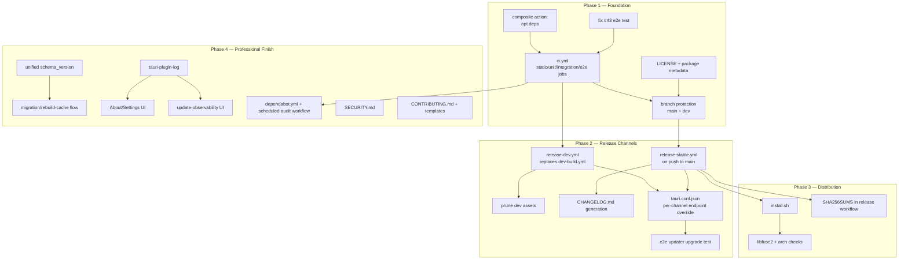

# Linux MVP: One-Line Install and Self-Updating Releases — Design

**Spec**: `.specs/features/linux-mvp-release/spec.md`
**Status**: Approved

---

## Architecture Overview

Four largely independent subsystems, built in the spec's phase order because each later one assumes the earlier one is trustworthy:



**Key structural decision:** replace the single `dev-build.yml` with three workflows sharing one composite action, rather than growing one mega-workflow:

- `.github/actions/setup-tauri-build/action.yml` — composite action: node/corepack/rust toolchain/rust-cache/apt deps/pnpm install. Used by all three workflows below so the dependency list can never drift (spec MVP-41 AC3, MVP-56 AC1).
- `.github/workflows/ci.yml` — `pull_request`, and `push` to `main`/`dev`. Jobs: `static`, `unit`, `integration`, `e2e`. No publish step ever lives here.
- `.github/workflows/release-dev.yml` — `push` to `dev`, `needs: ci` (via `workflow_call` or a job-level gate — see Tech Decisions), builds with the `dev` updater endpoint, prunes prior `dev` assets, publishes prerelease.
- `.github/workflows/release-stable.yml` — `push` to `main`, `needs: ci`, no-ops if `tauri.conf.json` version already has a matching GitHub release, otherwise builds with the `stable` updater endpoint, generates changelog, publishes non-prerelease.

This keeps each workflow single-purpose and testable in isolation, matches the spec's phase boundaries 1:1, and avoids one growing YAML file accumulating conditional branches for two very different publish policies (prune-and-replace vs. keep-forever).

---

## Code Reuse Analysis

### Existing Components to Leverage

| Component | Location | How to Use |
| --- | --- | --- |
| `Makefile` check targets | `Makefile:15-66` | `ci.yml` jobs call these directly (`make lock-check format lint typecheck`, `make test-quick`, `make test-rust-integration`, `make test-desktop-e2e`) — CI is a thin wrapper, not a parallel definition of the gate. |
| `dev-build.yml`'s apt/node/rust setup steps | `.github/workflows/dev-build.yml:17-38` | Lifted verbatim into the new composite action; `dev-build.yml` itself is deleted once `release-dev.yml` replaces it. |
| `Swatinem/rust-cache@v2`, pnpm store cache | `.github/workflows/dev-build.yml:28-30` | Reused unchanged in the composite action. |
| `tauri-action@v0` with `args: --config '{...}'` override | `.github/workflows/dev-build.yml:47-60` | Same mechanism extended to also override `plugins.updater.endpoints`, not just `version` (spec MVP-44). |
| Cargo workspace `license.workspace = true` | `Cargo.toml` `[workspace.package]`, `apps/desktop/src-tauri/Cargo.toml` | Already `MIT` — Rust side of MVP-40 is **already done**; only `LICENSE` file, README, and npm `package.json` fields remain. |
| `vault_metadata` table + `schema_version` column | `apps/desktop/src-tauri/src/settings.rs:499-520` | Becomes the single source of truth for the unified version check (see Data Models) instead of adding a third versioning mechanism. |
| `KnowledgeStore::schema_version()` / `PRAGMA user_version` | `crates/knowledge-storage/src/lib.rs:451-455` | Read during the startup version-compare branch (spec MVP-52 AC2); no change to how it's stored, only to what compares against it. |
| `AISettings.tsx` settings module pattern | `apps/desktop/src/settings/AISettings.tsx` | New "About" section follows the same file/test/component conventions (sibling file in `apps/desktop/src/settings/`). |
| `PANE_BOUNDS` / `resizePane` clamp logic | `apps/desktop/src/workspace/layout.ts:32-77` | Root-cause investigation for #43 starts here per the spec; likely fix is in the `AppShell.tsx` persistence call, not this file (see Risks). |

### Integration Points

| System | Integration Method |
| --- | --- |
| GitHub Releases API | Both `release-dev.yml` (delete-then-upload for pruning) and `install.sh` (resolve latest stable via `/releases/latest`) call it — `gh release` CLI in workflows, plain `curl` to the REST API in the shell script (no auth needed for public reads). |
| Tauri updater plugin | Already wired (`lib.rs:22`); design only changes *what* `check_for_updates` does with errors (log instead of discard) and *which* endpoint is compiled in (build-time config override), not the plugin wiring itself. |
| Stronghold-held credentials | Untouched by this feature — migration design (MVP-52) explicitly asks "what happens to Stronghold credentials across versions" as an open question the design **defers to a fixed answer**: Stronghold's own vault file is versioned independently by the plugin and is out of scope for the app's schema_version check (see Tech Decisions). |

---

## Components

### 1. `.github/actions/setup-tauri-build/action.yml` (composite action)

- **Purpose**: single source of truth for Node/corepack/Rust/apt setup, used by `ci.yml`, `release-dev.yml`, `release-stable.yml`.
- **Location**: `.github/actions/setup-tauri-build/action.yml`
- **Interfaces**: a composite GitHub Action with no required inputs (matches current unconditional setup); outputs nothing, just leaves the runner ready.
- **Dependencies**: `actions/setup-node@v4`, `dtolnay/rust-toolchain@stable`, `Swatinem/rust-cache@v2`, apt packages.
- **Reuses**: exact step list from `dev-build.yml:17-38`.

### 2. `.github/workflows/ci.yml`

- **Purpose**: run the full `make check` surface on every PR and every push to `main`/`dev`; the only thing every other workflow gates on.
- **Location**: `.github/workflows/ci.yml`
- **Interfaces**: 4 jobs (`static`, `unit`, `integration`, `e2e`), each `uses: ./.github/actions/setup-tauri-build` then a `make` target; `concurrency: group: ci-${{ github.ref }}, cancel-in-progress: true`.
- **Dependencies**: composite action above; `make` targets already defined.
- **Reuses**: `Makefile` targets unchanged.

### 3. `.github/workflows/release-dev.yml`

- **Purpose**: publish prerelease dev builds on every push to `dev`, gated on CI, pruning prior assets, using the dev updater endpoint.
- **Location**: `.github/workflows/release-dev.yml`
- **Interfaces**: single `build-and-publish` job; a pre-publish step calling `gh release delete-asset` (or `gh release delete dev --cleanup-tag=false` + recreate) to clear prior assets before `tauri-action` uploads new ones.
- **Dependencies**: composite action, CI success (`workflow_run` trigger keyed on `ci.yml` completing on `dev`, OR a `needs:` job that re-runs `make check` inline — see Tech Decisions for which).
- **Reuses**: `tauri-action@v0` invocation pattern from the old `dev-build.yml`, with the config override extended to also set the dev updater endpoint (redundant with the already-baked default, set explicitly for clarity and drift-proofing).

### 4. `.github/workflows/release-stable.yml`

- **Purpose**: publish a real semver-tagged, changelogged, non-prerelease build from `main`, only when the version actually changed.
- **Location**: `.github/workflows/release-stable.yml`
- **Interfaces**: a `check-version` job (reads `tauri.conf.json` version, compares against `gh release list` / `gh api repos/.../releases/latest`, sets a `should_publish` output) → a `build-and-publish` job that only runs `if: needs.check-version.outputs.should_publish == 'true'`.
- **Dependencies**: composite action, CI success, `git-cliff` (or equivalent) for changelog generation.
- **Reuses**: same `tauri-action@v0` pattern, config override sets the **stable** updater endpoint and `prerelease: false`.

### 5. `install.sh`

- **Purpose**: one-line installer — resolve latest stable release, verify, install, integrate with the desktop launcher.
- **Location**: repository root (served via `raw.githubusercontent.com/.../main/install.sh`).
- **Interfaces**: POSIX `sh` script; flags: `--uninstall`. No other flags needed per spec.
- **Dependencies**: `curl`, `sha256sum`/`shasum`, optionally `minisign` if present (falls back to embedded verification logic if not — see Tech Decisions), standard `~/.local` XDG conventions.
- **Reuses**: the `SHA256SUMS`/`SHA256SUMS.sig` and per-asset `.sig` files already produced by the release workflows (P3.2); embeds the same minisign public key already in `tauri.conf.json:44`.

### 6. Rust: unified schema-version check (`apps/desktop/src-tauri/src/migration.rs`, new)

- **Purpose**: single startup gate that reads both existing version concepts, compares against what the binary expects, and branches to up-to-date / migrate / rebuild-cache / refuse.
- **Location**: `apps/desktop/src-tauri/src/migration.rs`
- **Interfaces**:
  - `pub fn check_vault_compatibility(vault_root: &Path) -> Result<CompatibilityDecision, MigrationError>`
  - `pub enum CompatibilityDecision { UpToDate, RebuildCache, Refuse(String) }`
- **Dependencies**: `settings.rs`'s `vault_metadata.schema_version`, `knowledge-storage`'s `PRAGMA user_version` — **unified** so the app-level check only reads one authoritative field going forward (see Data Models).
- **Reuses**: `KnowledgeStore::open`/`schema_version()`, `initialize_vault_structure`'s existing `vault_metadata` table (extended, not replaced).

### 7. Rust: `tauri-plugin-log` wiring + rotating log

- **Purpose**: local rotating log file for panics, unrecoverable errors, and update attempts/outcomes.
- **Location**: `apps/desktop/src-tauri/src/lib.rs` (plugin registration), new `apps/desktop/src-tauri/src/logging.rs` (redaction guard).
- **Interfaces**: `pub fn init_logging(app: &tauri::App) -> Result<(), LogError>`; a `#[cfg(test)]` guard/test asserting no note content or credential strings reach the log sink.
- **Dependencies**: `tauri-plugin-log` (official Tauri plugin — see Tech Decisions for why this over a hand-rolled `tracing` subscriber).
- **Reuses**: existing `app.path().app_local_data_dir()` (`lib.rs:25`) as the log directory root.

### 8. React: About section in Settings

- **Purpose**: show version, channel, pending-restart state, update failures.
- **Location**: `apps/desktop/src/settings/About.tsx` (new, sibling to `AISettings.tsx`)
- **Interfaces**: `<AboutSection updateState={UpdateState} version={string} channel={"stable"|"dev"} />`; `UpdateState = "idle" | "checking" | "pending-restart" | "failed"`.
- **Dependencies**: a new Tauri command exposing version/channel/update-state to the renderer (`commands::get_app_info` or similar, following the existing `commands::*` module pattern already used for settings).
- **Reuses**: `AISettings.tsx`'s component/test structure and IPC-command pattern.

---

## Data Models

### Unified vault/schema versioning (resolves the two-concept split found during design research)

Today two independent version fields exist for the same physical DB file:

- `vault_metadata.schema_version` (`settings.rs:516`) — currently always `1`, bootstrapped at vault creation, never compared against anything.
- `PRAGMA user_version` (`knowledge-storage/src/lib.rs:145`) — currently `2`, bumped by `MIGRATION_V1`, read by `KnowledgeStore::schema_version()`, also never compared against a binary-side expectation.

**Design decision:** `PRAGMA user_version` becomes the single authoritative schema version (it already belongs to the crate that owns the actual table DDL and migrations). `vault_metadata.schema_version` is repurposed as the **vault-format version** (covers Markdown front-matter shape, directory layout — things outside SQLite entirely), since the spec (MVP-52) explicitly asks for a vault-format version distinct from the SQLite schema version. This reuses both existing columns for their natural purpose instead of adding a third.

```typescript
// Conceptual model (Rust structs mirror this; not currently typed on the frontend)
interface VaultCompatibility {
  sqliteSchemaVersion: number;      // PRAGMA user_version, source: knowledge-storage
  vaultFormatVersion: number;       // vault_metadata.schema_version, source: settings.rs
  binaryExpectedSqliteSchema: number;   // compiled-in constant, bumped alongside MIGRATION_V2 etc.
  binaryExpectedVaultFormat: number;    // compiled-in constant
}
```

**Relationships**: `CompatibilityDecision` (component 6) is a pure function of comparing the four fields above:

| sqlite cmp | format cmp | Decision |
| --- | --- | --- |
| `==` | `==` | `UpToDate` |
| `<` | `<=` | `RebuildCache` (SQLite is reconstructible per AD-002; rebuild from Markdown) |
| `<=` | `<` | `RebuildCache` if a defined vault-format migration exists for this version jump, else `Refuse` |
| `>` (vault is newer than binary) | any | `Refuse("This vault was last opened by a newer version...")` |

### `SHA256SUMS` release manifest

```
<sha256 hex>  Knowledge.OS_0.2.0_amd64.AppImage
<sha256 hex>  Knowledge.OS_0.2.0_amd64.deb
<sha256 hex>  latest.json
```
Plain text, one line per artifact, generated by `sha256sum apps/desktop/src-tauri/target/release/bundle/**/* > SHA256SUMS` in the release workflow before upload; `SHA256SUMS.sig` is `minisign -S` over that file using the same CI-held signing key already used for artifact signatures.

---

## Error Handling Strategy

| Error Scenario | Handling | User Impact |
| --- | --- | --- |
| CI job fails on a PR | Required status check red; merge button disabled by branch protection | Contributor sees which job failed and why, in the PR checks tab |
| `release-stable.yml` version already published | `check-version` job sets `should_publish=false`; `build-and-publish` job skipped entirely (not even attempted) | No release created, no duplicate ~88MB upload; visible in the Actions run as a skipped job, not a failure |
| Updater signature verification fails (real or simulated bad signature) | `update.download_and_install` returns `Err`; now logged via `tauri-plugin-log` instead of `let _ =` discard | User sees a "update failed" state in About (P4.5) instead of silent no-op indistinguishable from up-to-date |
| Installer downloads a tampered/truncated artifact | `sha256sum`/minisign check in `install.sh` fails before `chmod +x`/move step | Script exits non-zero with an explicit "verification failed, not installing" message; no partial install left in place |
| App opens a vault from a newer version | `CompatibilityDecision::Refuse` | Dialog stating the vault requires a newer app version; app does not touch the vault |
| App opens a vault from an older version needing a rebuild | `CompatibilityDecision::RebuildCache` | Observable progress UI; on completion, normal app state; on failure mid-rebuild, original Markdown is untouched (cache is disposable, rebuilt into a fresh SQLite file, swapped only on success) |
| `libfuse2` missing on install | Installer detects via `ldconfig -p | grep libfuse` or attempting a `--appimage-extract-and-run` fallback probe | Exact apt/dnf/pacman line printed for the detected distro, script exits without a half-finished install |

---

## Risks & Concerns

| Concern | Location | Impact | Mitigation |
| --- | --- | --- | --- |
| Two independent, never-cross-checked schema-version concepts already exist in shipped code | `settings.rs:516`, `knowledge-storage/src/lib.rs:145` | Silent confusion/incorrect migration decisions if left as-is — exactly the "worst possible defect" the epic warns about | Unify per Data Models section above; add a task specifically to write the comparison function with a test matrix covering all four decision-table rows before any release ships with cross-version installs in the wild |
| `check_for_updates` discards all errors via `let _ =` and early-return `?`-style `Ok(...) else { return; }` | `lib.rs:66-78` | Update failures are silently indistinguishable from "already up to date" — directly named as a risk in spec MVP-47/48 | Rewrite to propagate a typed result into the logging component (component 7) before Phase 2/4 work lands |
| `resizePane`/`layout.ts` persistence bug (#43) not yet root-caused | `apps/desktop/src/workspace/layout.ts:69-77`, `AppShell.tsx` persistence call site (not yet located exactly) | Blocks the entire CI gate (P1.2) from landing green | First task in Phase 1 must trace the exact `AppShell.tsx` save/restore call (likely `localStorage`) before touching CI, per spec P1.4's AC1 |
| No logging infrastructure exists at all today | confirmed absent across `src-tauri/src/*.rs` and all crate `Cargo.toml`s | P4.4 (crash logging) and P2.4/P4.5 (update observability) both depend on this not existing yet — sequencing risk if tasks are parallelized | Land `tauri-plugin-log` wiring (component 7) as its own early Phase 4 task; P2.4 and P4.5's logging ACs depend on it, not the reverse |
| `packages/contracts`, `packages/ui`, `packages/test-fixtures` are all `"private": true` | `packages/*/package.json:3` | MVP-40 AC3 ("license field set... in each published workspace package") has no target — nothing is actually published to npm | Interpret AC3 narrowly: set `license` field on these `private` packages anyway for consistency/tooling (some linters check it regardless of `private`), but do not treat "publish to npm" as in scope — flagged here rather than silently reinterpreting the AC |
| GitHub Actions pinned by mutable major tag (`actions/checkout@v4` etc.) | `dev-build.yml:17-26` | MVP-54 names this directly as a supply-chain gap (compromised tag risk) | Dependabot config includes `github-actions` ecosystem per spec; do not pin to full SHA in this pass (scope creep beyond what MVP-54's AC asks) unless a task explicitly adds it |

> All identified concerns have a mitigation folded into the phase plan above; none require a scope change to the spec.

---

## Tech Decisions

| Decision | Choice | Rationale |
| --- | --- | --- |
| CI-gates-release mechanism | `release-dev.yml`/`release-stable.yml` re-run `make check` inline via `needs: ci-static, ci-unit, ci-integration, ci-e2e` job dependencies within the **same workflow run** (reusable workflow via `workflow_call`), rather than a separate `workflow_run` trigger watching `ci.yml` | `workflow_run` decouples the two workflows' commit SHAs in edge cases (race conditions between separate workflow runs) and is harder to reason about; a `workflow_call`'d `ci.yml` guarantees the exact commit that passed CI is the exact commit that gets published, satisfying spec MVP-42 AC1's "no publish step is reachable on a red run" precisely. |
| Dev-channel pruning mechanism | Delete-then-upload via `gh release delete-asset` for each existing asset on the `dev` tag, scoped explicitly by hardcoding `tagName: dev` as a literal (never a variable) in the deletion step | Spec MVP-46 AC4 requires deletion be verifiably scoped to `dev` only; a literal string in the workflow is trivially auditable by code review, versus a variable that could theoretically resolve to a stable tag under a future refactor. |
| Logging library | `tauri-plugin-log` (official first-party Tauri plugin) over a hand-rolled `tracing`/`log` subscriber | Already Linux-only, already Tauri 2; the official plugin gives rotation, a documented app-data-dir target, and a JS-side `attachConsole()` for free, satisfying MVP-55/48 without a bespoke file-rotation implementation. Respects AD-012 ("no new runtime dependency") only in the *frontend renderer* sense — AD-012's stated scope is "the desktop renderer" (AD-012 Scope: "renderer do desktop"); a Rust-side Tauri plugin is a backend/native dependency, not a renderer one, so it does not violate that decision. Flagged explicitly since it's a new dependency and AD-012 exists — if the owner reads AD-012 as covering the whole app rather than just the renderer, this needs to be revisited as a superseding decision before Phase 4 lands. |
| Installer verification tooling | Ship a minimal pure-`sh`/`openssl`-based minisign-compatible verifier embedded in `install.sh` rather than requiring the user to have `minisign` installed | Spec MVP-49 AC3 requires verification to actually happen, not merely be documented; requiring an extra binary install as a prerequisite to the installer undermines "one pasted command." (If a full minisign-compatible verifier proves impractical in pure shell, fallback is checking for a system `minisign` and installing/prompting for it as a one-time dependency — decide during Phase 3 implementation, not blocking Design.) |
| Vault-format vs SQLite schema version unification | Repurpose existing `vault_metadata.schema_version` as vault-format version; keep `PRAGMA user_version` as SQLite schema version (see Data Models) | Reuses both existing fields for their natural domain rather than introducing a third version concept; avoids a migration of the migration-tracking mechanism itself. |
| Stronghold credential versioning | Out of scope for `check_vault_compatibility` — Stronghold manages its own snapshot format/versioning independently, and the app's compatibility gate only ever inspects it for existence/openability, never for a version number to compare | MVP-52 raises the question but the spec's own migration proposal only requires a decision, not a specific mechanism; Stronghold's plugin already handles its own format compatibility, so re-implementing that here would duplicate existing guarantees rather than fill a gap. |

> **Project-level decision to record:** the `tauri-plugin-log` addition is a new native (Rust-side) dependency, and AD-012 currently reads narrowly-but-ambiguously about "no new runtime dependency... implemented no próprio repositório" scoped to "o renderer do desktop." Recommend appending a clarifying `AD-014` to `.specs/STATE.md` once this is approved, stating explicitly that AD-012 applies to the frontend renderer only and that native Tauri plugins for backend concerns (logging, updater, etc.) are governed separately by normal dependency-review judgment — this closes a real ambiguity rather than silently assuming an interpretation.
